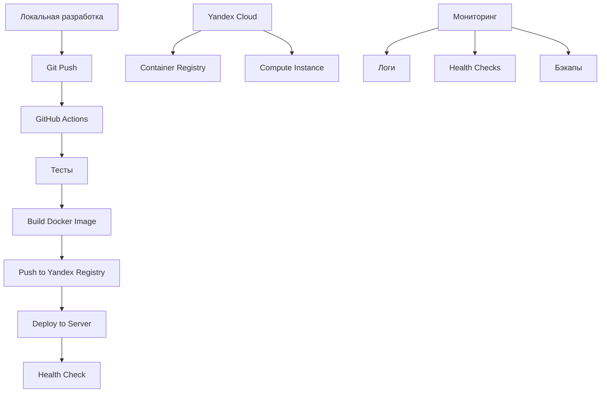

# 🚀 Руководство по деплою WPG Engine

Это руководство описывает процесс автоматизированного деплоя телеграм-бота WPG Engine на Yandex Cloud с использованием Docker и GitHub Actions.

## 📋 Содержание

- [Быстрый старт](#быстрый-старт)
- [Архитектура деплоя](#архитектура-деплоя)
- [Настройка окружения](#настройка-окружения)
- [Локальная разработка](#локальная-разработка)
- [Автоматический деплой](#автоматический-деплой)
- [Ручной деплой](#ручной-деплой)
- [Мониторинг](#мониторинг)
- [Устранение неполадок](#устранение-неполадок)

## 🚀 Быстрый старт

### 1. Локальная разработка

```bash
# Клонируйте репозиторий
git clone <your-repo-url>
cd reload-wpg-engine

# Настройте окружение
make setup

# Отредактируйте .env файл
nano .env

# Запустите в режиме разработки
make run-dev

# Просмотр логов
make logs
```

### 2. Деплой в продакшн

```bash
# Настройте GitHub Secrets (см. раздел ниже)
# Затем просто сделайте push в main ветку
git push origin main

# Или ручной деплой
make deploy-prod
```

## 🏗️ Архитектура деплоя



## ⚙️ Настройка окружения

### Yandex Cloud

1. **Создайте Container Registry:**
```bash
yc container registry create --name wpg-engine-registry
```

2. **Создайте Compute Instance:**
```bash
yc compute instance create \
  --name wpg-engine-server \
  --zone ru-central1-a \
  --network-interface subnet-name=default-ru-central1-a,nat-ip-version=ipv4 \
  --create-boot-disk image-folder-id=standard-images,image-family=ubuntu-2004-lts,size=20 \
  --ssh-key ~/.ssh/id_rsa.pub
```

3. **Настройте Docker на сервере:**
```bash
# Подключитесь к серверу
yc compute ssh --name wpg-engine-server

# Установите Docker
curl -fsSL https://get.docker.com -o get-docker.sh
sudo sh get-docker.sh
sudo usermod -aG docker $USER

# Настройте аутентификацию в Container Registry
yc container registry configure-docker
```

### GitHub Secrets

Добавьте следующие секреты в настройках репозитория GitHub:

| Секрет | Описание | Пример |
|--------|----------|--------|
| `TG_TOKEN` | Токен Telegram бота | `1234567890:ABCdefGHIjklMNOpqrsTUVwxyz` |
| `TG_ADMIN_ID` | ID администратора | `123456789` |
| `AI_OPENROUTER_API_KEY` | API ключ OpenRouter | `sk-or-v1-...` |
| `YC_SA_JSON_CREDENTIALS` | JSON ключ сервисного аккаунта | `{"id": "...", "key": "..."}` |
| `YC_REGISTRY_ID` | ID Container Registry | `crp1234567890abcdef` |
| `YC_CLOUD_ID` | ID облака | `b1g1234567890abcdef` |
| `YC_FOLDER_ID` | ID папки | `b1g1234567890abcdef` |
| `YC_INSTANCE_IP` | IP адрес сервера | `51.250.1.1` |
| `YC_INSTANCE_USER` | Пользователь на сервере | `ubuntu` |
| `YC_INSTANCE_NAME` | Имя инстанса | `wpg-engine-server` |

## 💻 Локальная разработка

### Использование Docker Compose

```bash
# Запуск в режиме разработки
make run-dev

# Запуск в продакшн режиме
make run

# Просмотр логов
make logs

# Остановка
make down
```

### Использование скриптов

```bash
# Сборка и тестирование
./scripts/local-test.sh build
./scripts/local-test.sh run
./scripts/local-test.sh logs

# Остановка и очистка
./scripts/local-test.sh stop
./scripts/local-test.sh clean
```

### Без Docker

```bash
# Установка зависимостей
make install

# Запуск
make local-run

# Тесты
make local-test
```

## 🤖 Автоматический деплой

### GitHub Actions Workflow

Автоматический деплой запускается при:
- Push в ветку `main`
- Pull Request в ветку `main` (только тесты)

Процесс включает:
1. **Тестирование** - запуск тестов и линтеров
2. **Сборка** - создание Docker образа
3. **Публикация** - загрузка в Yandex Container Registry
4. **Деплой** - обновление на сервере
5. **Проверка** - health check после деплоя

### Мониторинг деплоя

```bash
# Просмотр статуса в GitHub Actions
# https://github.com/your-username/your-repo/actions

# Проверка на сервере
ssh user@your-server-ip
docker ps | grep wpg-engine
docker logs wpg-engine-bot
```

## 🛠️ Ручной деплой

### Полный деплой

```bash
# Деплой в продакшн
make deploy-prod

# Деплой в staging
make deploy-staging

# Деплой в dev
make deploy-dev
```

### Пошаговый деплой

```bash
# 1. Сборка образа
make build

# 2. Тестирование
make test

# 3. Деплой
./scripts/deploy.sh prod
```

### Только обновление на сервере

```bash
# Если образ уже собран и загружен в registry
ssh user@server-ip
docker pull cr.yandex/your-registry-id/wpg-engine-bot:latest
docker stop wpg-engine-bot
docker rm wpg-engine-bot
docker run -d --name wpg-engine-bot --restart unless-stopped \
  -e TG_TOKEN="your-token" \
  -v /opt/wpg-engine/data:/app/data \
  cr.yandex/your-registry-id/wpg-engine-bot:latest
```

## 📊 Мониторинг

### Проверка статуса

```bash
# Статус контейнера
make status

# Health check
make health

# Системная информация
./scripts/monitor.sh sysinfo
```

### Логи

```bash
# Последние логи
make logs

# Следить за логами в реальном времени
make monitor

# Конкретное количество строк
./scripts/monitor.sh logs 100
```

### Бэкапы

```bash
# Создать бэкап базы данных
make backup

# Автоматические бэкапы (добавить в crontab)
0 2 * * * /path/to/scripts/monitor.sh backup
```

### Перезапуск

```bash
# Перезапуск контейнера
make restart

# Полная перезагрузка
make down && make up
```

## 🔧 Управление окружениями

### Переменные окружения

- `.env` - локальная разработка
- `.env.staging` - staging окружение
- `.env.prod` - продакшн окружение

### Переключение между окружениями

```bash
# Копирование конфигурации
cp .env.prod .env

# Или использование напрямую
docker-compose --env-file .env.prod up -d
```

## 🚨 Устранение неполадок

### Контейнер не запускается

```bash
# Проверить логи
docker logs wpg-engine-bot

# Проверить образ
docker images | grep wpg-engine

# Проверить переменные окружения
docker inspect wpg-engine-bot | grep -A 20 "Env"
```

### Проблемы с базой данных

```bash
# Проверить подключение к БД
docker exec wpg-engine-bot python -c "
import asyncio
from wpg_engine.models import get_db
asyncio.run(next(get_db()).__anext__())
"

# Пересоздать базу данных
docker exec wpg-engine-bot python recreate_database.py
```

### Проблемы с сетью

```bash
# Проверить порты
docker port wpg-engine-bot

# Проверить сеть
docker network ls
docker network inspect bridge
```

### Проблемы с деплоем

```bash
# Проверить GitHub Actions логи
# https://github.com/your-repo/actions

# Проверить доступ к серверу
ssh -v user@server-ip

# Проверить Docker Registry
yc container registry list
yc container image list --registry-id your-registry-id
```

### Откат версии

```bash
# Посмотреть доступные образы
yc container image list --registry-id your-registry-id

# Запустить предыдущую версию
docker run -d --name wpg-engine-bot \
  cr.yandex/your-registry-id/wpg-engine-bot:previous-tag
```

## 📚 Полезные команды

### Docker

```bash
# Очистка системы
docker system prune -a

# Просмотр использования ресурсов
docker stats

# Экспорт/импорт образа
docker save wpg-engine > wpg-engine.tar
docker load < wpg-engine.tar
```

### Yandex Cloud

```bash
# Список инстансов
yc compute instance list

# Подключение к инстансу
yc compute ssh --name wpg-engine-server

# Мониторинг ресурсов
yc monitoring metric-data get
```

### Makefile команды

```bash
make help          # Показать все доступные команды
make help-prod     # Помощь по продакшн деплою
make help-dev      # Помощь по разработке
make quick-test    # Быстрое тестирование
make quick-deploy  # Быстрый деплой
```

## 🔐 Безопасность

### Рекомендации

1. **Используйте отдельные токены** для разных окружений
2. **Регулярно обновляйте** секреты в GitHub
3. **Ограничьте доступ** к серверу по SSH ключам
4. **Используйте HTTPS** для webhook'ов
5. **Регулярно обновляйте** базовые образы Docker

### Мониторинг безопасности

```bash
# Проверка уязвимостей в образе
docker scan wpg-engine

# Проверка открытых портов
nmap your-server-ip

# Мониторинг логов безопасности
tail -f /var/log/auth.log
```

## 📞 Поддержка

При возникновении проблем:

1. Проверьте [раздел устранения неполадок](#устранение-неполадок)
2. Посмотрите логи: `make logs`
3. Проверьте статус: `make health`
4. Создайте issue в репозитории с подробным описанием проблемы

---

**Удачного деплоя! 🚀**